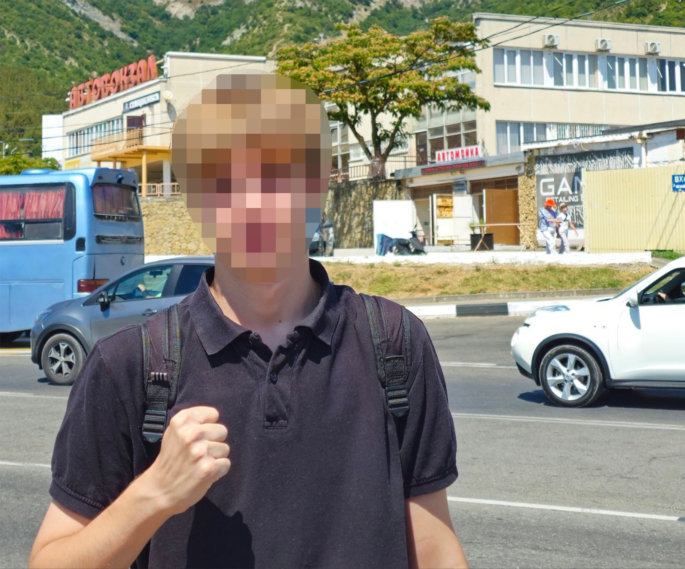

# [osint] Morning without coordinates

> **Категория:** `osint`  
> **CTF:** KubSTU CTF 2026 Spring

Сложность: medium

Сессия позади — редкий момент, когда можно выдохнуть.
Вечером решили отметить окончание экзаменов и, как это часто бывает, слегка переоценили свои силы.

Утром оказалось, что один из нашей компании пропал. Последнее, что помнят все — мы были где-то на Красноармейской. Дальше — провал.

После обеда пропавший выходит на связь и присылает фотографию с сообщением:

 

*«Вроде всё нормально. Пахнет морем, без понятия где я. Скиньте денег, попытаюсь домой добраться»*.

Телефон на последнем дыхании, GPS глушат, а голова у всех по-прежнему тяжёлая.

Вся надежда на тебя — единственного, кто сохранил ясность мышления.
**Определи город и точный адрес, где была сделана фотография.**

Формат флага - `KubSTU{CityName_StreetName_BuildingNumber}`

---

## **Определяем зону поиска**

Начинаем с самого простого — **внимательно смотрим на фото** и вспоминаем вводные из сюжета.

По легенде мы всё ещё в **Краснодарском крае**, плюс в сообщении от пропавшего есть жирная подсказка:

> *«Пахнет морем»*

А на фоне фотографии отчётливо видны **горы**. В Краснодарском крае это сильно сужает зону поиска:
горы + море = побережье.

Фактически остаётся полоса от **Сочи до Новороссийска**.

---

## **Находим город**

Дальше переходим к деталям на самом снимке. На заднем плане хорошо различимо крупное здание с характерной архитектурой и надписью — выглядит как **автовокзал**.
Это уже отличная зацепка, потому что:

- автовокзалов не так много,
- у них часто есть фотографии в открытых источниках.

Пробуем простой и логичный путь:
выбираем самые крупные города и поочерёдно гуглим запросы вида

> автовокзал <город>

и смотрим фотографии.

На запросе **«автовокзал Геленджик»** довольно быстро находится здание, которое **полностью совпадает** с тем, что видно на фото: форма, этажность, фасад — всё 1 в 1.

 

---

## **Потерявшийся найден**

Теперь, когда город найден, осталось определить **точное место съёмки**.

Открываем карты, находим **автовокзал Геленджика** и включаем режим панорам.
Дальше — немного терпения: осматриваемся вокруг, двигаемся вдоль дороги, смотрим на остановки и углы обзора.

В итоге находится точка:

- остановка напротив автовокзала,
- ракурс совпадает с фотографией,
- положение зданий и дороги сходится

 

 

---

## Ура, финал

Флаг - `KubSTU{Gelendzhik_Obezdnaya_3}` 
(При написании флага игнорируем твёрдый знак)

