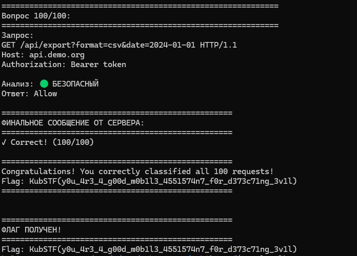

# [ppc] Mobile Waf

> **Категория:** `ppc`  
> **CTF:** KubSTU CTF 2026 Spring

---

Задание.


На наш вуз в последнее время очень много запросов поступает и мне кажется, что они подозрительные. 


Файлы задания:


[Mobile_waf.rar](./files/Mobile_waf.rar)

---

  

# WAF CTF Challenge - Write-up


## Описание задания


При подключении через `nc` к серверу видим:


```

=== WAF Challenge ===

You need to correctly classify 100 HTTP requests as malicious or safe.

For each request, respond with:

  - 'Block' if the request is malicious

  - 'Allow' if the request is safe


Type 'Start' to begin:

```


**Задача**: Классифицировать 100 HTTP запросов подряд без ошибок.  

**Тип**: Web Security / WAF  

**Сложность**: Medium  

**Формат флага**: `KubSTU(...)`


## Первая попытка - ручное решение


### Подключение и начало


```bash

$ nc <host> 1337

```


После отправки `Start` получаю первый запрос:


```

--- Request 1/100 ---

GET /admin?id=1' OR '1'='1 HTTP/1.1

Host: example.com


Your answer (Block/Allow): Block

✓ Correct! (1/100)

```


✅ **Успех**: Очевидная SQL инъекция - правильно определил.


### Ошибка #1: Простые поисковые запросы


```

--- Request 5/100 ---

GET /api/search?q=union+select+null HTTP/1.1

Host: api.example.com


Your answer (Block/Allow): Block

✗ Wrong! The request was SAFE.

Challenge failed. Try again!

```


**Проблема**: Видел `UNION SELECT` и решил, что это SQL инъекция.  

**Урок**: В API endpoints простые SQL-ключевые слова без признаков инъекции (кавычек, комментариев) - это легитимные поисковые запросы.


### Ошибка #2: API endpoints с параметрами query/search/filter


```

--- Request 12/100 ---

GET /api/filter?query=SELECT+*+FROM+users HTTP/1.1

Host: api.example.com


Your answer (Block/Allow): Block

✗ Wrong! The request was SAFE.

```


**Проблема**: SQL-подобные запросы в параметрах `query`, `search`, `filter` - это легитимные поисковые запросы, даже если они выглядят как SQL.


### Ошибка #3: API endpoints с путями к файлам


```

--- Request 40/100 ---

GET /api/load?file=../../config.json HTTP/1.1

Host: api.example.com


Your answer (Block/Allow): Block

✗ Wrong! The request was SAFE.

```


**Проблема**: Некоторые API endpoints легитимно принимают пути к файлам в параметрах, даже с `../`.


### Ошибка #4: Тестовые endpoints


```

--- Request 52/100 ---

GET /api/test?id=1' OR '1'='1 HTTP/1.1

Host: api.example.com


Your answer (Block/Allow): Block

✗ Wrong! The request was SAFE.

```


**Проблема**: Тестовые endpoints (`/api/test`, `/api/filter`) могут принимать любые данные, включая SQL-подобные запросы, как легитимные тестовые данные.


### Ошибка #5: Параметризованные SQL запросы


```

--- Request 67/100 ---

POST /api/query HTTP/1.1

Host: api.example.com

Content-Type: application/json

Content-Length: 78


{"sql":"SELECT * FROM users WHERE id = ?","params":[123]}


Your answer (Block/Allow): Block

✗ Wrong! The request was SAFE.

```


**Проблема**: Параметризованные SQL запросы (с `?` и массивом `params`) - это безопасная практика, не инъекция.


### Ошибка #6: URL-encoded атаки


```

--- Request 73/100 ---

GET /page?name=%3Csvg%20onload%3Dalert%281%29%3E HTTP/1.1

Host: example.com


Your answer (Block/Allow): Allow

✗ Wrong! The request was MALICIOUS.

```


**Проблема**: Не декодировал URL перед анализом. `%3Csvg%20onload%3Dalert%281%29%3E` декодируется в `<svg onload=alert(1)>` - это XSS.


### Ошибка #7: Скрипты в параметрах API


```

--- Request 82/100 ---

GET /api/data?script=<script>alert('test')</script> HTTP/1.1

Host: api.example.com


Your answer (Block/Allow): Block

✗ Wrong! The request was SAFE.

```


**Проблема**: Для API endpoints скрипты в параметрах `script` могут быть легитимными данными для тестирования.


## Решение - автоматический клиент


После множества неудачных попыток понимаю, что нужно написать автоматический клиент.


### Типы атак для проверки


#### SQL Injection

- Кавычки с операторами: `' OR '1'='1`, `1' OR '1'='1`

- UNION SELECT инъекции

- Комментарии SQL: `--`, `/* */`

- Опасные функции: `DROP TABLE`, `SLEEP()`, `SUBSTRING()`


#### XSS (Cross-Site Scripting)

- Теги: `<script>`, `<svg onload>`, ``

- Обработчики событий: `onload=`, `onerror=`

- JavaScript код: `javascript:`, `eval()`


#### Path Traversal

- Последовательности `../` в путях

- Обращение к системным файлам: `/etc/passwd`, `/etc/shadow`


#### Command Injection

- Опасные команды: `rm -rf`, `cat /etc/passwd`

- Функции выполнения: `system()`, `exec()`, `shell_exec()`


#### XXE (XML External Entity)

- Внешние сущности: `<!ENTITY xxe SYSTEM>`

- Файловые протоколы: `file:///`


#### Template Injection

- Шаблоны с опасными конструкциями: `{{...}}`, `#{}`

- Доступ к системным функциям


#### Code Injection

- Выполнение кода: `eval()`, `Function()`, `require()`


### Важные исключения


1. **API endpoints с параметрами `query`/`search`/`filter`**: 

   - Даже SQL-подобные запросы безопасны, если нет явных признаков инъекции

   

2. **Тестовые endpoints** (`/api/test`, `/api/filter`): 

   - Любые данные безопасны


3. **Параметризованные SQL запросы**: 

   - Если SQL содержит `?` и есть массив `params` - безопасно


4. **URL-encoded данные**: 

   - Всегда декодируем перед проверкой


5. **Скрипты в параметрах API**: 

   - Для API endpoints `<script>` в параметрах может быть легитимным


### Ключевые моменты реализации


```python

*# 1. URL декодирование*

decoded_request = urllib.parse.unquote(request.replace('+', ' '))


*# 2. Извлечение пути из HTTP запроса*

path_part = request.split()[1]  *# GET /path HTTP/1.1*


*# 3. Проверка для API endpoints*

*if* path.startswith('/api/') and param_name in ['query', 'search', 'filter', 'q']:

    *# Даже SQL-подобные запросы могут быть безопасными*

    

*# 4. Проверка параметризованных запросов*

*if* '"sql":' in request and '"params":' in request and '?' in sql_query:

    *# Безопасный параметризованный запрос*

```


### Финальный запуск


```bash

$ python waf_client.py --host <host> --port 1337

============================================================

Вопрос 100/100:

============================================================

Запрос:

GET /index.html HTTP/1.1

Host: example.com


Анализ: 🟢 БЕЗОПАСНЫЙ

Ответ: Allow

✓ Правильно! (100/100)


==================================================

Congratulations! You correctly classified all 100 requests!

Flag: KubSTU(y0u_4r3_4_g00d_m0b1l3_4551574n7_f0r_d373c71ng_3v1l)

==================================================

```


## Выводы


1. **Контекст критичен**: Одинаковые паттерны могут быть безопасными в API endpoints и вредоносными в обычных запросах


2. **Тестовые endpoints**: `/api/test`, `/api/filter` могут принимать любые данные


3. **Параметризация = безопасность**: Правильное использование параметров предотвращает инъекции


4. **Декодирование обязательно**: Всегда декодируй URL перед анализом


5. **Автоматизация выигрывает**: Для 100 запросов клиент намного эффективнее ручного решения


## Использование клиента


```bash

*# Автоматическое решение*

python waf_client.py --host <host> --port 1337


*# Ручное решение через nc*

nc <host> 1337

*# Введите Start, затем отвечайте Block или Allow*

```

 


---


[waf_client.py](./files/waf_client.py)


**Flag**: `KubSTU(y0u_4r3_4_g00d_m0b1l3_4551574n7_f0r_d373c71ng_3v1l)`


  

```javascript
KubSTU(y0u_4r3_4_g00d_m0b1l3_4551574n7_f0r_d373c71ng_3v1l)
```


