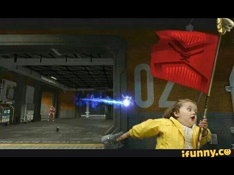

# [stego] bembembem

> **Категория:** `stego`  
> **CTF:** KubSTU CTF 2026 Spring

---

Сложность: hard
Здесь точно есть флаг, но придётся пройти через Мурино, Молочное и возможно встретить котость

## Шаг 0 — разведка

file bembembem.mp4
ffprobe -v error -show_format -show_streams bembembem.mp4
exiftool bembembem.mp4
strings bembembem.mp4 | grep -iE 'BEM|b3m|flag'
В exiftool/ffprobe сразу заметны подозрительные теги TikTok: aigc_info, comment=vid:..., vid_md5=6899efc8f52bffb08c5ac45deee24f64. Пока отметили.

## Шаг 1 — найти кастомный uuid box

Стандартный MP4 состоит из ftyp, moov, mdat и пр. Любой дополнительный uuid-атом — красный флаг. Парсим top-level boxes:
# mp4_walk.py
import struct, sys



def walk(path: str) -> None:
    with open(path, "rb") as f:
        data = f.read()
    total = len(data)
    print(f"file size: {total}")
    print(f"{'offset':>12} {'size':>12}  type")

    pos = 0
    while pos < total:
        if total - pos < 8:
            print(f"  !! trailing {total - pos} bytes at {pos}")
            break
        size  = struct.unpack(">I", data[pos:pos + 4])[0]
        btype = data[pos + 4:pos + 8].decode("ascii", errors="replace")
        if size == 1:
            size = struct.unpack(">Q", data[pos + 8:pos + 16])[0]
        elif size == 0:
            size = total - pos
        print(f"{pos:>12} {size:>12}  {btype}")

        if size <= 0 or pos + size > total:
            print(f"  !! invalid box at {pos}, stopping walk")
            break
        pos += size


if __name__ == "__main__":
    walk(sys.argv[1] if len(sys.argv) > 1 else "bembembem.mp4")

Результат:
0          32           b'ftyp'
32         3884477      b'moov'
3884509    8            b'free'
3884517    264587170    b'mdat'
268471687  970          b'uuid'      ← вот оно
268472657  ...          мусор (не box)
Читаем содержимое uuid-бокса: 16 байт UUID + payload. UUID узнаваемый: b3eb3eb3eb3eb3eb3eb3eb3eb3eb3eb3 (сигнатура автора).
Payload начинается с BEM/v1\n# decode: base64 -> zlib inflate -> utf-8\n — сам формат задокументирован в первой строке.
import base64, zlib
payload = data[268471687 + 8 + 16 : 268471687 + 970]
lines = payload.strip().split(b"\n")
b64 = b"".join(l for l in lines[1:] if not l.startswith(b"#"))
riddle = zlib.decompress(base64.b64decode(b64)).decode("utf-8")
print(riddle)
Получаем записку на русском в три строфы:
I. слушать не ушами — смотреть цветами звука (нормалдаки).
   сорок вторая минута, выше десяти тысяч (омайгадность).
   что рисует шёпот в спектре — то и кодовое слово.
   (регистр важен, ровно 8 символов.)
II. у этого MP4 длинный хвост. хвост запечатан —
   за последним атомом лежит груз, XORенный
   повторяющимся ключом. ключ уже в метаданных
   файла, зверь носит его на лбу: vid_md5 в hex
   (32 ASCII-символа).
III. под печатью — старый сундук формата PK.
    отопри тем, что прошептал спектр.
    внутри: виноград, сливы, яблоки на зелёных, бананы

## Шаг 2 — спектрограмма в 42-й минуте

ffmpeg -ss 2520 -i bembembem.mp4 -t 4 -vn -ac 1 probe.wav
sox probe.wav -n spectrogram -o spec.png -x 1400 -y 500
Открываем spec.png — в диапазоне ~10.5–14.5 kHz читается K0t05t (его также видно в Sonic Visualiser / Audacity).
Пароль найден: K0t05t.

## Шаг 3 — XOR-ключ из метаданных

ffprobe -v error -show_entries format_tags=vid_md5 \
  -of default=nk=1:nw=1 bembembem.mp4
# 6899efc8f52bffb08c5ac45deee24f64
Значение именно как ASCII-строка (32 символа) — ключ для XOR.

## Шаг 4 — вытащить и расшифровать хвост

Хвост файла начинается сразу после uuid-бокса, на offset 268472657:
KEY = b"6899efc8f52bffb08c5ac45deee24f64"
tail = data[268472657:]
plain = bytes(b ^ KEY[i % len(KEY)] for i, b in enumerate(tail))
open("recovered.zip","wb").write(plain)
Проверка: plain[:4] == b'PK\\x03\\x04' — это ZIP-магия. Отлично.
Альтернативный путь без знания точного оффсета: слайдинг-окно XOR с ключом + поиск сигнатуры PK\\x03\\x04 в декодированном буфере. binwalk без расшифровки ZIP не найдёт, потому что XOR ломает магию — это и есть штраф за пропуск слоя 3.

## Шаг 5 — открыть архив

unzip -P K0t05t recovered.zip
cat flag.txt
# KubSTU{3nj0y_1h_0f_M3ll57r0y_m3m3s}

## 🚩 Флаг

```
KubSTU{3nj0y_1h_0f_M3ll57r0y_m3m3s}
```
