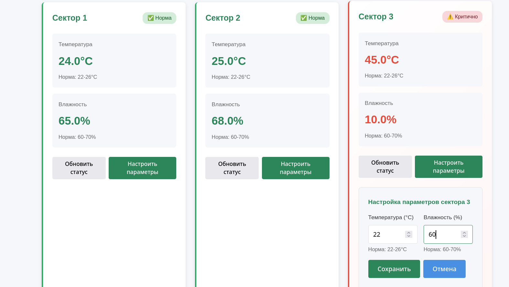

# [web] CapyAgro Crop Rescue

> **Категория:** `web`  
> **CTF:** KubSTU CTF 2026 Spring

## Описание

В экспериментальной теплице №3 на территории CapyAgro произошёл сбой системы управления.Штатные инженеры не могут получить доступ к панели управления. Растения гибнут. 

Вам, как внешним аудиторам, нужно найти способ восстановить контроль над системой и вернуть параметры в норму

## Решение

1) Gосле регистрации попробовать изменить свои виртуальные сектора 

 

2) Перехватываем анализируем отправленный пакет

 

 3) Проанализируем целевой сектор и получим id целевого устройства

 

4) воспользуемся этим и передадим новые значения Сектору CapyArgo подменив id устройства

 

5) Стабилизировали сектор и получили флаг

## Флаг

```graphql
KubSTU(Sav3d_th3_CapyArg0S3ct0r)
```


