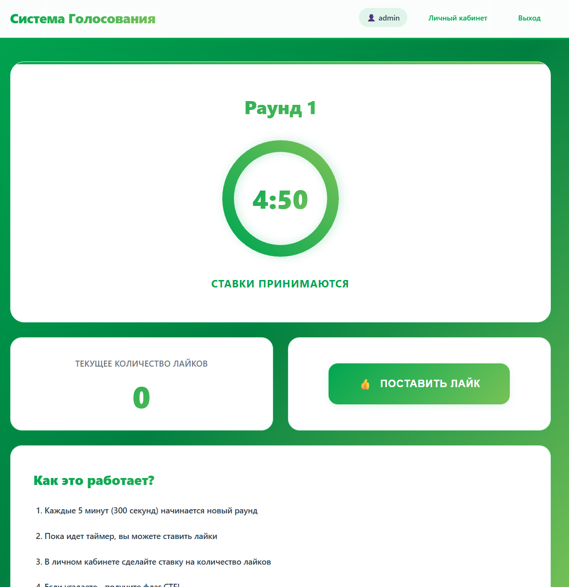
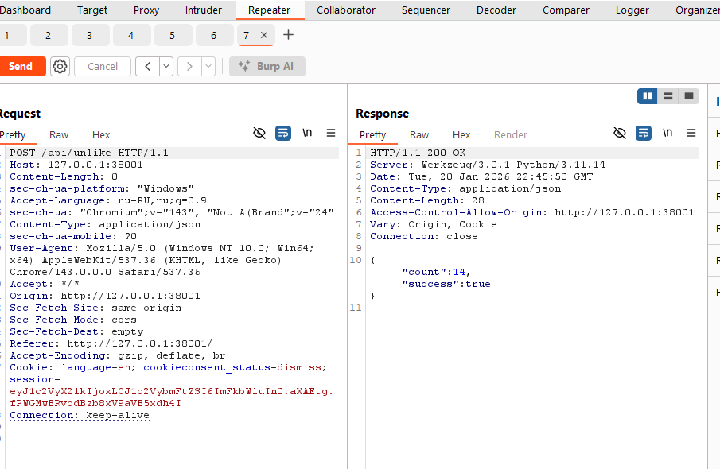
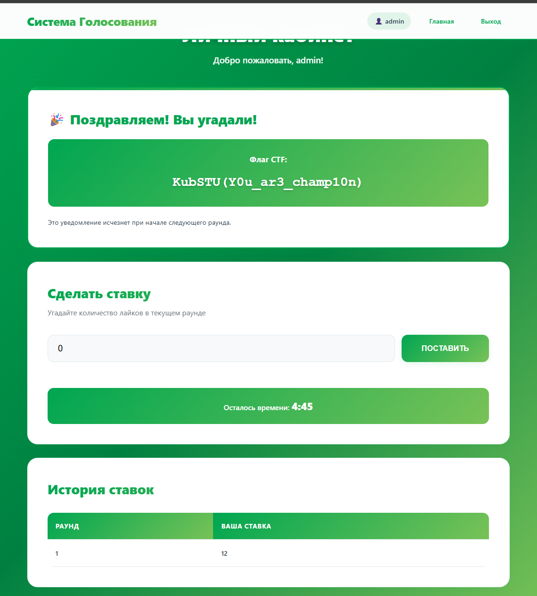

# [web] The Battle of the Strongest

> **Категория:** `web`  
> **CTF:** KubSTU CTF 2026 Spring

---

## Легенда

  

Каждый семестр студенты-капибары спорят о том, какой факультет лучше, кто сильнее в учебе, кто активнее в студенческой жизни.

В этом году капибары-энтузиасты решили перевести соперничество в цифровую плоскость и создали инновационный сервис **"Битва сильнейших"** (The Battle of the Strongest). Только вот кажется не самый безопасный сервис.


Файлы задания

[The_Battle_of_the_Strongest.rar](./files/The_Battle_of_the_Strongest.rar)

---

Заходим на сервис и регистрируемся 

нас переносит на главную страницу


 


Суть задания в том что несколько команд заходят и могут выбрать количество лайков которое будет в конце раунда.


 

Я поставил 12

Переходим и видим 0 


 

если поставить лайк 


 

и кнопка станет красной

если нажать убрать -1 будет.

Хорошо. Ловим запрос.


 


замечаем что если отправить 2 раз - сервер примет. Проверка только на клиенте значит.


 


Спамим до нужного числа, оно у нас 12


 


переборщили, пробуем уменьшить


 

Пробуем


 

и получаем 12 


 

Ждем конца времени и смотрим чтоб количество лайков оставалось в нужном количестве. 

На практике в начале стф естсественно будет соперничество и победит логика и хорошие ботнеты.


 

Переходим в личный кабинет


 

---

```javascript
KubSTU(Y0u_ar3_champ10n)
```


